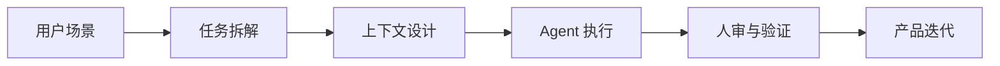

# 你好，我是李心怡

**AI 产品经理｜创作者增长｜AIGC 创作工具｜Agentic Product Building**

我关注的是：怎么把 AI 从“生成内容的工具”变成真正进入用户工作流的产品能力。过去我做过作者侧 AI 创作工具、直播创作者增长和信贷平台产品；现在也在持续用 Agent coding 做自己的 AI-native 产品原型。

我不是只把 AI 当作提效工具，而是把它当作产品系统的一部分：用户输入、上下文、模型能力、失败兜底、体验验证和数据反馈，都需要被一起设计。

## 我现在关注的方向

- **AI-native 产品落地**：从模糊想法出发，拆成可执行的产品、原型、工程和验证任务。
- **Agentic 工作流**：用 Agent 做调研、PRD、原型、代码和测试，但保留人的产品判断。
- **创作者工具**：围绕小说作者、直播创作者和内容创作者，提升创作效率、转化和内容供给质量。
- **互动内容体验**：关注情绪书写、互动叙事、AI 记忆系统和年轻用户文化。

## 代表项目

### 海岛邮局 Ocean Island Diary

一个围绕“写信、投递、收到回应、回看记忆”的 AI 情绪书写产品。

- 设计完整的沉浸式写信链路，而不是普通聊天入口。
- 使用 AI 回复、情绪理解、匿名身份和历史记忆，让用户多次书写时获得连续感。
- 通过 Agent coding 拆解产品、前端、提示词、存储和验证任务，快速完成可运行原型。
- 项目仓库：[Ocean-Island-Diary](https://github.com/lixinyi2331018-create/Ocean-Island-Diary)

## 工作经历关键词

### TikTok LIVE｜创作者增长产品

- 负责创作者开播增长相关产品，搭建端内触达、激励任务和创作者转化链路。
- 将 AIGC 素材生产、用户特征匹配和增长实验结合，提高触达效率和转化效果。
- 关注增长质量，不只看短期拉新，也关注 ROI、复访和创作者长期活跃。

### 番茄小说国际化｜AI 产品

- 从 0 到 1 负责作者侧 AI 创作工具，包括 AI 故事生成、AI 写作助手、AI 封面、多封面实验和 AI 插图。
- 重点解决作者灵感不足、写作效率低、内容包装质量不稳定等问题。
- 关注模型输出质量、作者采纳率、创作效率和内容消费表现之间的平衡。

### 蚂蚁集团｜信贷平台产品

- 做过商品、签约、计费等平台能力，关注复杂规则下的系统准确性和业务风险控制。
- 这段经历让我更重视产品逻辑、异常场景、数据链路和可解释性。

## 我的 AI 产品方法

- **先定义问题**：先判断用户真实阻塞点和业务目标，再决定要不要用 AI。
- **把上下文做成产品能力**：输入结构、历史记忆、约束条件和输出格式都需要设计。
- **用 Agent 放大执行密度**：把调研、原型、开发、测试拆成清晰任务，而不是只让 AI 写一段文案。
- **用真实反馈校验**：模型输出好看不代表产品有效，最终要回到用户行为和业务指标。

## 技能与工具

`AI Product Management` · `AIGC` · `Creator Growth` · `Agentic Workflow` · `Prompt Design` · `Context Engineering` · `SQL` · `Python` · `Next.js` · `Axure` · `Sketch`

## 我喜欢的问题

- AI 怎么真正进入创作者的日常工作流？
- Agent 能不能让产品经理更快完成高质量探索，而不是只生成更多文档？
- 情绪陪伴和互动叙事，怎样做得更像产品，而不是一次性聊天？
- 年轻用户为什么会被某种内容、社区或互动形式吸引？
